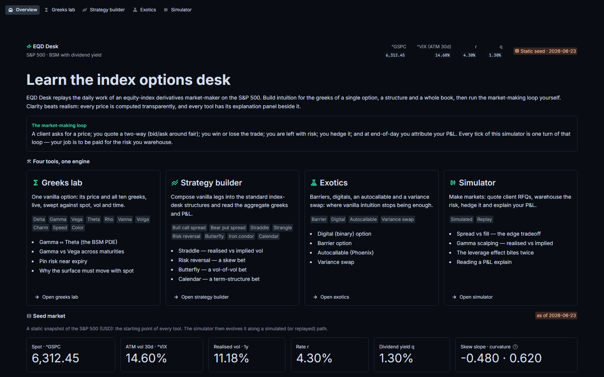
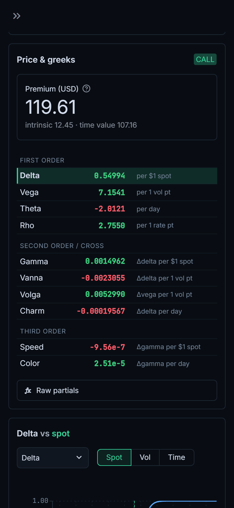
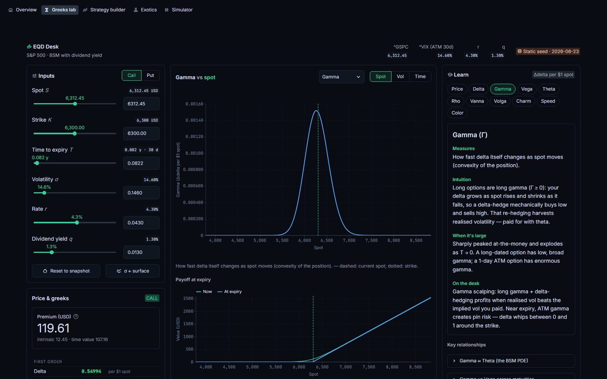
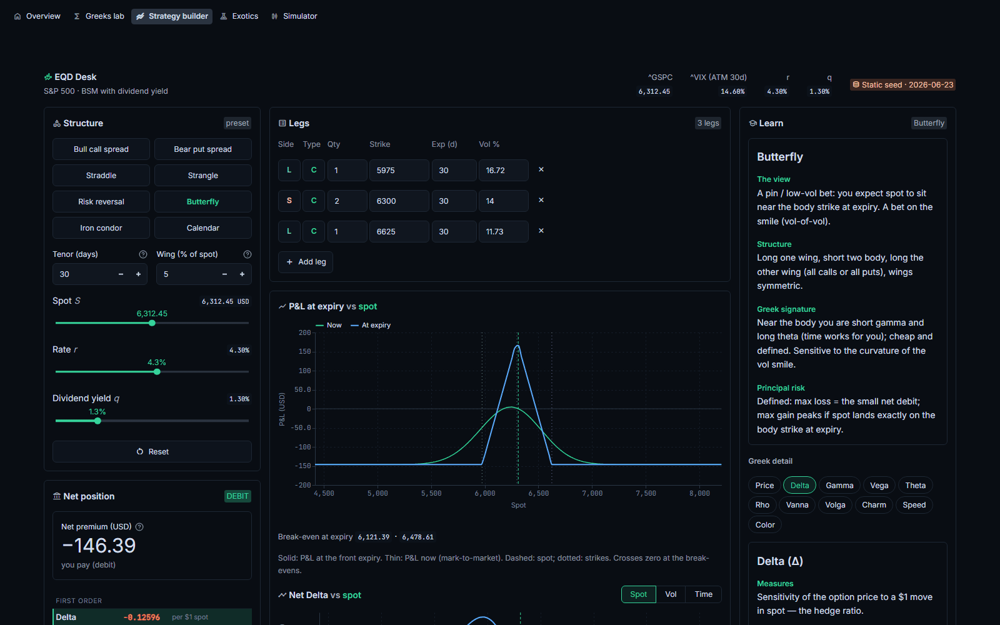
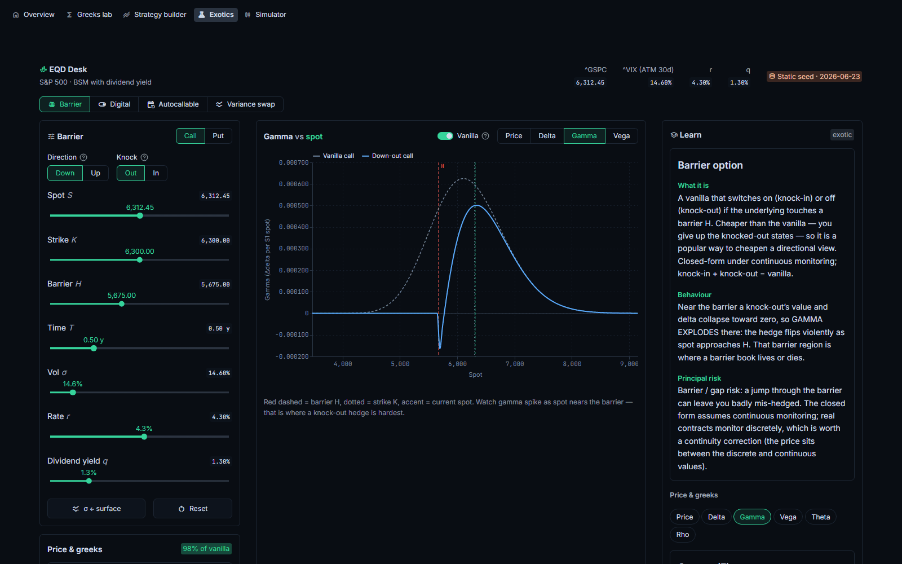
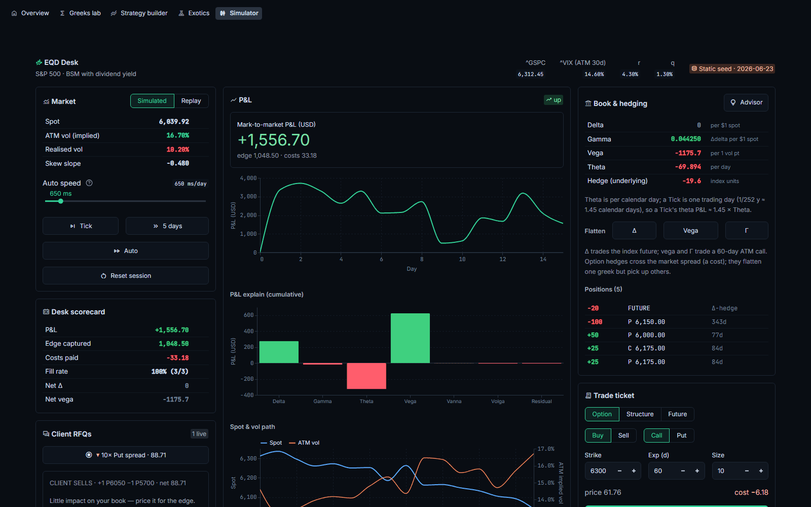

# EQD Desk

[](https://github.com/ALX-7777/eqd-desk/actions/workflows/ci.yml)


**Try it live: <https://eqd-desk.streamlit.app>** (no install, works on a phone) ·
original React version: <https://alx-7777.github.io/eqd-desk/>

A training desk for **equity-index derivatives market-making**, built for EQD trading
interview prep. It replays the daily work of an index options market-maker on the S&P 500
(SPX, with Euro Stoxx 50 as a one-flag alternative): price a vanilla and read its greeks,
build structures, meet the exotics, then run the market-making loop yourself. A client asks
for a price, you quote a two-way, you win or lose the trade, you hedge the risk you are left
with, and you explain your P&L.

Clarity beats realism. Every price and greek is computed from scratch in readable, tested
code; the market is simulated (or replayed) so that it is controllable and repeatable; and
every tool has a written explanation panel beside it.



> New to options market-making? [`docs/TRADING_GUIDE.md`](docs/TRADING_GUIDE.md) is the
> companion "how to trade well" tutorial: greeks, volatility, structures, quoting, hedging
> and P&L attribution, tied feature by feature to the app.

## Quick start

The app is a Python package with a Streamlit UI. With [uv](https://docs.astral.sh/uv/):

```bash
git clone https://github.com/ALX-7777/eqd-desk.git
cd eqd-desk
uv sync
uv run eqd-desk                 # http://localhost:8501
```

`eqd-desk` passes any `streamlit run` option through (`uv run eqd-desk --server.port 8080`);
`uv run streamlit run src/eqd_desk/app/streamlit_app.py` is equivalent. To try it without
cloning:

```bash
uvx --from git+https://github.com/ALX-7777/eqd-desk eqd-desk
```

### Docker

```bash
docker compose up --build       # http://localhost:8501
```

or the image that CI publishes to GitHub Container Registry (amd64 and arm64):

```bash
docker run --rm -p 8501:8501 ghcr.io/alx-7777/eqd-desk:latest
```

To serve on another port, set it through the environment so that the container health check
follows: `docker run --rm -e STREAMLIT_SERVER_PORT=8080 -p 8080:8080 ghcr.io/alx-7777/eqd-desk`.

### In the browser, from anywhere



- **The Streamlit app** runs on Streamlit Community Cloud at <https://eqd-desk.streamlit.app>
  and redeploys on every push to `main`. To host your own copy (free): sign in at
  [share.streamlit.io](https://share.streamlit.io) with GitHub, choose *Create app*, pick your
  fork, branch `main` and main file path `src/eqd_desk/app/streamlit_app.py`, then *Deploy*.
  Dependencies come from `uv.lock`; the theme ships next to the entrypoint.
- **The original React app** is a static site, deployed by CI to GitHub Pages:
  <https://alx-7777.github.io/eqd-desk/>.

<br clear="right">


## The four tools

### Greeks lab



One vanilla option under Black–Scholes–Merton with a continuous dividend yield `q`: its price
and all ten greeks (delta, gamma, vega, theta, rho, vanna, volga, charm, speed, color),
updating as you drag spot, strike, time, vol, rate and dividend yield. Plot any greek against
spot, vol or time to expiry, next to the payoff at expiry. The Learn panel covers each greek
and the relationships that matter on a desk: gamma against theta (the BSM PDE), gamma against
vega across maturities, and pin risk near expiry. Shrink `T` and ATM gamma spikes into a tall,
narrow peak; lengthen it and gamma trades down while vega rises.

### Strategy builder



Compose vanilla legs into a position: vertical spreads, straddle, strangle, risk reversal,
butterfly, iron condor and calendar presets, or hand-edited legs. It shows the net premium
(debit or credit), the aggregate greeks, the P&L at expiry against spot with its break-evens,
and the net greek profiles. Each leg's vol is read off the skewed surface. The Learn panel
explains the view each structure expresses: a risk reversal is a skew bet, a butterfly a
vol-of-vol bet, a calendar a term-structure bet.

### Exotics



Where vanilla intuition stops being enough:

- **Barriers**: Reiner–Rubinstein closed forms for down/up, in/out. Watch gamma explode at the
  barrier.
- **Digitals**: cash-or-nothing and asset-or-nothing, against the call spread that replicates
  them. The pin-risk step at expiry.
- **Autocallable**: a Phoenix note priced by Monte Carlo, with sample paths and
  early-redemption diagnostics.
- **Variance swap**: fair variance from the 1/K² option strip, and the convexity premium over
  ATM vol that the VIX is built on.

Every closed form is cross-checked against Monte Carlo, parity or an analytic limit in the
tests.

### Simulator



The market-making loop on a skewed vol surface that **moves with spot** (the leverage effect:
spot down, vol up), so vanna and volga show up in your P&L. The market is either a simulated
GBM path or a **historical replay** of an undisclosed slice of real ^GSPC and ^VIX history.
Client RFQs arrive for singles and structures (straddle, strangle, risk reversal, verticals);
you quote a two-way with a spread and a lean, win or lose, and hedge: delta with the index
future, vega and gamma with listed options through a trade ticket that crosses a real cost.
A desk scorecard (P&L, edge, costs, fill rate, risk flags) and a live **P&L explain** break
each move into delta, gamma, theta, vega, vanna and volga plus a residual, tying it to
realised against implied vol (gamma scalping).

## How the numbers are computed

- **Pricing and greeks from scratch.** `eqd_desk.engine` implements BSM and every greek as a
  documented pure function; no options library is used. Each greek is tested against a
  central finite difference of the pricer and against reference values.
- **Desk units.** The engine returns raw partials; one reporting layer converts them: vega,
  rho, vanna and volga per 1 vol or rate point, theta, charm and color per calendar day. `T`
  is a year fraction, and `r` and `q` are continuously compounded.
- **Seed market.** A committed snapshot sets the starting market: spot from the index, the
  30-day ATM vol from the vol index (VIX), the skew shape in log-moneyness from the SPY option
  chain (or a parametric equity skew when that fit is unavailable), `r` and `q`. The
  simulator then evolves spot and the whole surface from there.
- **Two implementations, one set of numbers.** The app was first written in React and
  TypeScript ([`web/`](web/)). The Python engine is a port of it, and the parity tests hold it
  to golden values exported from the TypeScript engine. The seeded random-number generator is
  a bit-exact port too, so Monte Carlo prices, simulated markets and even a scripted simulator
  session (driven through the real React component) reproduce step for step.
- **Tested.** Over 1,800 Python tests (unit, property-based, golden parity and Streamlit
  `AppTest` UI tests) and 220 TypeScript tests run in CI, together with ruff, `mypy --strict`
  and a smoke test of every page inside the Docker image.

## Repository layout

```text
src/eqd_desk/            the Python package
  engine/                pure pricing and risk, no UI dependencies: bsm, greeks, reporting
                         (desk units), strategy + presets, exotics/ (barrier, digital,
                         autocall, varswap, Monte Carlo), sim/ (market, rfq, quote, book,
                         pnl, replay, advisor)
  data/                  seed snapshot and replay history (package data), loaders, vol
                         surface, underlying presets
  content/               the teaching text of every Learn panel
  app/                   Streamlit UI: streamlit_app.py (entrypoint and navigation),
                         app_pages/, ui/ (charts, inputs, formatting), .streamlit/ (theme)
  cli.py                 the eqd-desk console script
tests/                   engine, parity (golden values from TS), data, content, ui (pure
                         helpers), app (Streamlit AppTest), infra (CLI, packaging, hygiene)
web/                     the original React + TypeScript app: the reference implementation
                         and the source of the golden values
scripts/                 fetch_snapshot.py, fetch_history.py: refresh the seed data (yfinance)
docs/                    TRADING_GUIDE.md (the trader's manual), WORKLOG.md (build log)
```

The product spec, including every convention above, is in [`CLAUDE.md`](CLAUDE.md).

## Development

```bash
uv sync                         # the app plus the dev tools (pytest, ruff, mypy)
uv run ruff format .
uv run ruff check .
uv run mypy                     # strict, over src/ and tests/
uv run pytest                   # the full suite
uv run pytest -m "not app"      # skip the Streamlit AppTest suites
uv run pytest -m "not slow"     # skip the Monte-Carlo-heavy tests
uvx pre-commit install          # optional: the same checks on every commit
```

The React app needs Node 20 or later:

```bash
cd web
npm ci
npm run dev                     # http://localhost:5173
npm test
npm run golden                  # regenerate tests/parity/golden/*.json from the TS engine
```

Commit the regenerated goldens after changing the TypeScript engine or the seed data: CI fails
when they are stale.

### Refreshing the seed data

The committed data is a static snapshot, so the app runs offline. To refresh it from Yahoo
Finance:

```bash
uv run --group scripts python scripts/fetch_snapshot.py --underlying spx   # or sx5e
uv run --group scripts python scripts/fetch_history.py --years 8
cd web && npm run golden
```

Both scripts write the package copy (`src/eqd_desk/data/`) and mirror it into the React app
(`web/src/data/`). Data fetching never runs inside the app.

## CI and delivery

[`ci.yml`](.github/workflows/ci.yml) runs on every push and pull request: ruff, mypy and pytest
on Python 3.12 and 3.13; lint, types, tests, build and golden freshness for the React app; and
a Docker build whose smoke test runs every page inside the image. Only when all of that passes,
and never for a pull request, does it ship:

- the Docker image to `ghcr.io/alx-7777/eqd-desk` ([`publish.yml`](.github/workflows/publish.yml);
  `:latest` from main, `:X.Y.Z` from a `vX.Y.Z` tag);
- the React app to GitHub Pages at <https://alx-7777.github.io/eqd-desk/>
  ([`pages.yml`](.github/workflows/pages.yml)).

One-time repository setup: set Settings > Pages > Source to "GitHub Actions", and make the
GHCR package public after its first publish (new packages are private).

## License

[MIT](LICENSE). EQD Desk is a teaching tool: the market data is a static placeholder or a
simulation, and nothing here is investment advice.
